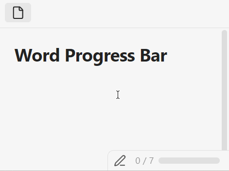

# Word Progress Bar for Obsidian

Track your writing progress with a miniature progress bar in the status bar.

Set a word count goal and watch the bar fill up as you write. When you hit your goal, it turns green.

## Usage

First, go to the settings, set `Words goal for all files` and toggle on `Progress bar for all files`. Open a note and start writing — the bar updates in real time.

🎯 Word goals for individual files and customization settings coming soon...

## Installation

### Manual

1. Download `main.js`, `manifest.json`, and `styles.css` from the [latest release](https://github.com/SomeNoY/obsidian-word-progress-bar/releases/latest)
2. Copy them to `<Vault>/.obsidian/plugins/word-progress-bar/`
3. Reload Obsidian and enable the plugin in Settings → Community plugins
